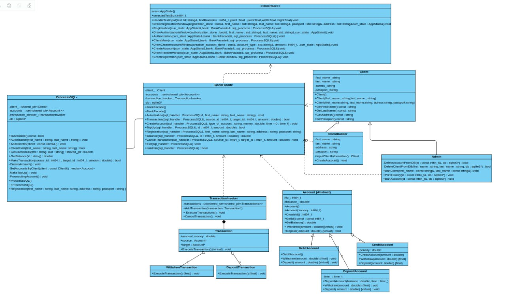
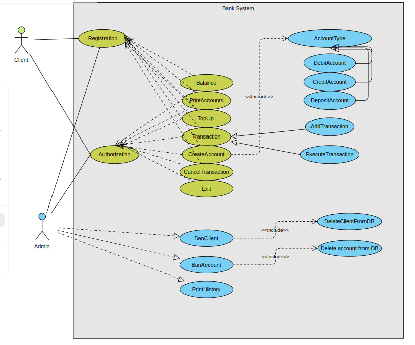

# Bank System TP2024


### О проекте

Этот проект реализует аналог банковской системы, позволяющий рбаотать клиенту с тремя виддами счётов : депозитовый, кредитный и диабетовый. Также он предоставляет возможность переводов и пополнения счёта. Все данные при этом записываются в бфзу данных.


# UML-диаграмма




# Диаграмма вариантов использования




## Запуск проекта:


### Версия С++ для запуска проекта : 3.10


1. Требуется установить библиотеку sqlite3, которая находится в папке lib  


Для этого нужно выполнить следующие команды находясь в корне репозитория:


```bash
cd lib  
./configure
make
make install
```


2. Запуск самого проекта


Для этого нужно выполнить следующие команды


```bash
cd built
cmake ..
make
./main
```


## Team

Morozova Sofiya              Б05-253      morozova.s@phystech.edu

Morochkovsky Vladislav       Б05-253      morochkovskii.va@phystech.edu
